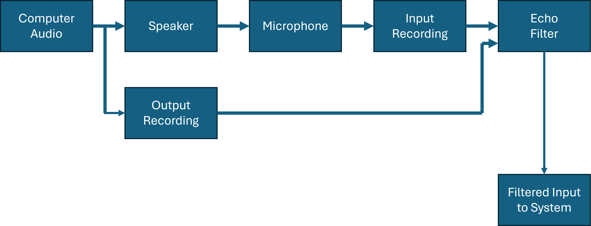

# speaker-noise-cancellation

## Objective
The purpose of this software is to capture the output of the speaker and cancel the echo of that output when the microphone records it. When the software is running, people on the call would not need to worry about the echoes from the speaker's output. 

## TODO 

* Make a makefile that will setup the soundfiles by running mp3_converter.py which converts the soundfile from mp3 format to wav formats locally.
* Make sure git doesn't upload the folder that is created by mp3_converter.py
* Modify recording.py to loop through all the demos from soundfiles/ and record all of the input to the microphone.
* figure out a method that would be able to compare the recorded file and the original file and allow us to filter it out (mathematically) maybe try PSNR?
* filter the output of the speaker out or suppress it. 

## Repository hierarchy 

### recording_pre_filter 
This is the directory where we store the recording of the sound data which we record from the microphone. These sound files will be used to determine the relationship between the stock sound file and the recording of the microphone on data such as latency, frequency, and amplitude of the recording in comparison to the original data. 

### soundfiles 
This is the directory where we put all the stock sound data, which we will use to be played from the speaker and recorded by the microphone.  

### recording.py
This file will allow you to play any designated sound file and record your microphone input at the same time. The recorded file will be placed in the recording folder. 
